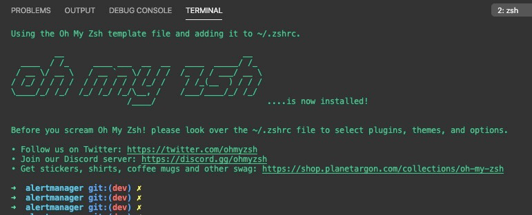
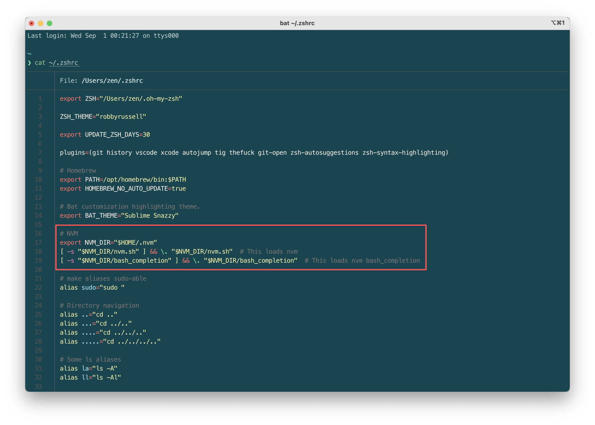
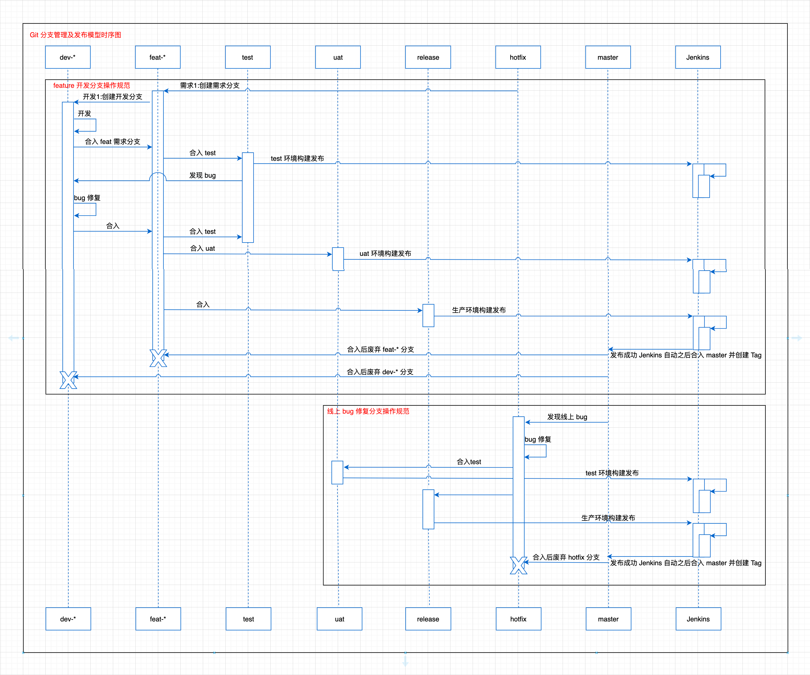

# 前端开发环境搭建

> 仅适用于 macOS

## 环境搭建

前端环境最小配置要求

- Node.js ≥ 14.17.0
- 包管理工具：[pnpm](https://pnpm.io/)

### ohmyzsh 配置

macOS 10.15 及以后的版本默认为 `zsh`

安装 ohmyzsh（因网络环境问题问题，可能需要搭配科学上网）：

```bash
sh -c "$(curl -fsSL https://raw.githubusercontent.com/robbyrussell/oh-my-zsh/master/tools/install.sh)"
```

安装之后：



配置了 ohmyzsh 之后，很多都清晰可见，例如：当前项目 repo 的状态信息。

除此之外，可以添加一些插件，满足个性化配置。

```bash
plugins=(git history vscode xcode autojump tig git-open zsh-autosuggestions zsh-syntax-highlighting)
```

### Homebrew

Homebrew 是 macOS 上不可或缺的套件管理器。拥有安装、卸载、更新、查看、搜索等很多实用的功能。简单的一条指令，就可以实现包管理，而不用你关心各种依赖和文件路径的情况。

将以下命令粘贴到终端：

```bash
/bin/bash -c "$(curl -fsSL https://raw.githubusercontent.com/Homebrew/install/HEAD/install.sh)"
```

对于使用 Apple Silicon Mac 需要额外在 `～/.zshrc` 添加配置：

```bash
export PATH=/opt/homebrew/bin:$PATH
```

Homebrew 安装的插件推荐如下：

- [autojump](https://github.com/wting/autojump)，目录间快速跳转
- [zsh-autosuggestions](https://github.com/zsh-users/zsh-autosuggestions)，命令提示
- [zsh-syntax-highlighting](https://github.com/zsh-users/zsh-syntax-highlighting)，命令高亮
- [bat](https://github.com/sharkdp/bat)，更好的 cat，可以配置 `alias cat="bat"`
- [jq](https://github.com/stedolan/jq)，JSON 处理器，配合 `pbcopy` & `pbpaste` 使用

- [thefuck](https://github.com/nvbn/thefuck)，纠正控制台中错误的命令
- [pnpm](https://pnpm.io/)，包管理工具
- [tig](https://github.com/jonas/tig)，命令交互式浏览 Git 日志
- [git-open](https://github.com/paulirish/git-open)，在浏览器打开当前项目的远程仓库地址

### Node.js(LTS && ≥ 14.17.0)

Node.js 因为多版本问题，推荐使用 `nvm` 进行管理。

将以下命令粘贴到终端：

```bash
curl https://raw.githubusercontent.com/creationix/nvm/master/install.sh | bash
```

打开 `～/.zshrc` 添加下列代码片段（对于 macOS Catalina 10.15.6 版本下使用 `~/.bash_profile`）：

```bash
export NVM_DIR="$HOME/.nvm"
[ -s "$NVM_DIR/nvm.sh" ] && \. "$NVM_DIR/nvm.sh"  # This loads nvm
[ -s "$NVM_DIR/bash_completion" ] && \. "$NVM_DIR/bash_completion"  # This loads nvm bash_completion
```



添加完之后执行：

```bash
source ~/.zshrc
```

接下来安装 Node.js

```bash
# 先查看最新的 Node.js 14（fermium） LTS 版本
nvm ls-remote --lts

nvm install v16.13.0
nvm use v16.13.0
nvm alias default v16.13.0

# 也可直接使用 stable
nvm install stable
nvm alias default stable
```

### 前端包管理工具：pnpm

[pnpm](https://pnpm.io/) 是目前前端最佳包管理工具（不推荐使用 npm、yarn）。

安装即可：（使用方式同 npm or yarn，详细请见：[https://pnpm.io/](https://pnpm.io/)）

```bash
# 安装
brew install pnpm

# 升级
brew upgrade pnpm
```

## 开发工具及其配置

### Visual Studio Code

前端开发工具推荐使用 Visual Studio Code（简称 vscode）

通用拓展推荐：

- Bracket Pair Colorizer 2：用颜色标识匹配的括号
- [Javascript Snippets](https://marketplace.visualstudio.com/items?itemName=algorizen.javascript-snippets)：JavaScript 代码片段补全
- DotENV：支持 .env 文件
- ESLint：代码规范 ESLint
- EditorConfig for VS Code
- Prettier - Code formatter：代码格式化
- GitLens：查看 Git 信息
- Visual Studio IntelliCode：代码补全
- CSS Peek
- Vetur：适用于 Vue 2 开发
- Vue Language Features (Volar)：适用于 Vue 3 开发

### iTerm2

终端工具推荐 [iTerm2](https://iterm2.com/)


# Git 规范<Badge text="WIP" />

## Git 分支管理



### Git 规范

**1. 分支规范**

我们遵循 `主干（master）集成、release上线分支、feat需求分支、dev开发分支`。

- 使用 `master` 作为稳定主分支。唯一性，不允许其他类似命名。
- 使用 `release` 作为上线分支。唯一性，不允许其他类似命名。
- 使用 `hotfix` 作为紧急Bug修复分支。
- 使用 `feat` 而非 `feature`。
- 使用 `dev` 而非 `development`、`develop` 等。
- 分支连接符使用 `` 而非 `_`， `.`等。例如：使用 `feat-` 而非 `feat_`。（因为分支名在非生产环境构建会被当作访问域名的一部分，不符合 [RFC 3986](https://datatracker.ietf.org/doc/html/rfc3986) 规范）
- 分支全部采用小写。

**2. 命名规范**

命名规则：**[类型]-([描述]｜[需求地址])-[开发者]**

1. **类型**：`feat`、`dev`、`hotfix`等
2. **开发者**：开发者姓名简拼，若有冲突可后缀添加工号。
3. **描述**：简要描述开发任务，使用英文字母/数字/连接符，禁止中文。
4. **需求地址**：可根据情况命名
    - 有 JIRA 地址的使用 [JIRA_ID]，例如：`hotfix-fe-14`、`feat-fe-14`
    - 有根据线上 Tag 版本的使用 [TAG_ID]，把`.`替换为``，例如：`hotfix-v1-2-3`
    - 对于 dev 开发分支，例如：`dev-feat-fe-14-hcy`

**3. Tag 规范**

Tag 需遵循 [语义化版本 semver](https://semver.org/lang/zh-CN/) 规范

命名规则：**[类型][release版本]-[stages版本]**

例如：

```js
v3.0.1
v3.0.0
v3.0.0-rc.3
v3.0.0-rc.2
v3.0.0-rc.1
v3.2.0-beta.3
v3.2.0-beta.2
v3.0.0-beta.1
v3.0.0-alpha.2
v3.0.0-alpha.1
v3.0.0-alpha.0
v2.7.8
```


# 代码注释规范

代码写出来是给人看的，附带能在机器上运行。既然是写给人看的，有两个方面比较重要。

1. 代码写的好。好的代码依赖 coder 的功底，想要写出好的代码，需要多修炼内功。
2. 注释写的好。就像我们上学的时候看文言文，字基本都认识，但是连在一起就是不知道什么意思。这个时候就依赖于注释了，注释能把文言文中难懂的词汇翻译成白话。代码注释也是一样的道理，用来解释代码的意义。

哪如何写好注释呢？

## 注释目的

1. 提高代码的可读性和可维护性
2. 提高代码编写效率和准确性，从而最终提高代码质量。
3. 快速导出接口文档

## 注释原则

一个原则「**As short as possible, As long as necessary**」。

- 如无必要，勿增注释 ( As short as possible )
- 如有必要，尽量详尽 ( As long as necessary )

「**如无必要，勿增注释**」是指注释能不写就不写，不要为了注释而注释。多余的注释等价于冗余的代码，除了不能增加可读性，一旦代码需要修改，修改注释也会是一大负担。

我们应当追求「**代码自注释**」，即代码本身就拥有较高的可读性（通过清晰的命名、合理的结构等）。举个例子：

```jsx
// bad
// 如果已经准备好数据，就渲染表格
if (data.success && data.result.length > 0) {
  renderTable(data)
}

// good
const isTableDataReady = data.success && data.result.length > 0;

isTableDataReady && renderTable(data)
```

「**如有必要，尽量详尽**」是指需要注释的地方应该尽量详尽地去写，让阅读者可以更好的了解代码的逻辑和意图。

## 注释规约

### 使用 `//` 作为单行注释

注释尽可能写在被注释对象的上方，不要追加在某条语句的后面。

注释行的上方需要有一个空行（除非注释行上方是一个块的顶部），以增加可读性。

注释内容和注释符之间需要有一个空格，以增加可读性。

```jsx
// bad
const active = true // is current tag

// bad
//is current tag
const active = true

// good
// is current tag
const active = true

// bad
function getType() {
  console.log('fetching type...')
  // set the default type to 'no type'
  const type = this._type || 'no type'

  return type
}

// good
function getType() {
  console.log('fetching type...')

  // set the default type to 'no type'
  const type = this._type || 'no type'

  return type
}

// bad
data() {
  return {
    isPageLoading: true,//页面loading
    isPageNetError: false,// 网络错误
    isPageNoSupport: false, //兜底页
  }
}

// good
data() {
  return {
    isPageLoading: true, // 页面loading
    isPageNetError: false, // 网络错误
    isPageNoSupport: false, // 兜底页
  }
}
```

### 使用 `/** ... */` 作为多行注释

注释包含描述、指定所有参数和返回值的类型和值。

```jsx
// bad
// make() 返回一个新元素
// 根据传入的 tag 名称
function make(tag) {
  // ...

  return element
}

// good
/**
 * make() 返回一个新元素
 * 根据传入的 tag 名称
 * 
 * @param {string} tag
 * @return {element} element
 */
function make(tag) {
  // ...

  return element
}
```

## 使用 Comment Tag

给注释增加 `FIXME`，`TODO` 等 Tag 前缀可以帮助其它开发者快速了解这是一个需要注意的问题。

常用的特殊标记如下：

- **BUG** - 应该修复的bug
- **FIXME** - 应该更正
- **HACK** - 解决方法
- **TODO** - 需要做的事
- **UNDONE** - 撤销或回滚之前的代码
- **XXX** - 警告其他程序员有问题或错误引导的代码

```jsx
// FIXME
function errorCode() {
  // ...
}
```

### 档类注释，如函数、类、文件、事件等，使用 JSDoc 规范

[JSDoc 规范](https://en.wikipedia.org/wiki/JSDoc)

```jsx
/**
 * 接口 - 获取榜单页面数据
 * 
 * 请求数据接口param参数
 * @param {string} rankType 榜单类型
 * @param {number} rankDataId 榜单ID
 */
async getBrandRankInfo() {
  //...
}
```

## 工具

- Better Comments：更人性化的注释

Better Comments 是一款开发插件，可以帮助开发者在代码中创建更人性化的注释。
# Code Review

Code Review 不仅仅保证代码质量，更重要的是通过代码交流学习各自的**代码设计**、**系统设计**

## 工具与角色

Code Review 所依赖的工具是 **GitLab**。

整个 Code Review 流程在 GitLab 项目中有两个点比较关键：

- `Merge Request`（简称：***MR***）
- `Discussion`（简称：***Diss***）

同时需要针对 GitLab 的项目进行配置：

- GitLab 和 钉钉 打通，每次有 MR 时会推送到钉钉
- 项目进行配置合并检查，所有的 Diss 都必须解决才能合并（Settings - General - Merge requests - Merge checks - All discussions must be resolved）

在 Code Review 过程中几个角色：

- ***Owner***（MR 发起者，需求负责人，代码改动提交者）
- ***Reviewers***（负责 Review 代码，MR 参与者，前端团队的同事，可能不止一个人）
- ***Disser***（某个 Reviewer，对某个 MR 发起 Discussion 的人）

## 原则

1. Owner 发起 MR 之前的代码需要进行充分自测
2. 如果版本改动较大，应提前在测试介入时就进行 Code Review（可通过 Repository - Compare）
3. 尽快响应 Code Review 请求，不阻塞他人的工作
4. 如果某个 MR 紧急，可以告知 Reviewers
5. 除有必要，Owner 不要在测试、验收阶段删除分支，应等待分支合入 Master 分支后移除
6. 定期回顾和总结 Code Review 执行情况

## 流程

1. Owner 在本地某分支开发完成，充分自测之后将代码推送到 GitLab。
2. 在 GitLab 发起 MR 之前，需保证当前分支代码已合并远端 Master 分支最新的代码****无冲突****并做 ****git rebase****。
3. Owner 成功发起 MR 后，会自动通过钉钉告知到群里，告知 Reviewers 有 MR 需要进行 Code Review，Owner 可告知 Reviewers 紧急程度。
4. Reviewers 基于 MR 进行进行 Code Review。如果对 MR 有任何问题，在 GitLab 上针对具体代码进行发起 Discussion，Review 完成后通知 Owner 结果（本次 MR 通过 / 本次 MR 有多少个 Diss）。如果有 Diss，Owner 需要对每一个 Diss 进行回复，直至所有 Diss 的状态变更为 Resolved。
5. Reviewers 对 MR 进行 Merge 操作，Owner 在测试环境发布代码，通知相关 QA 同学回归测试。
6. 如果测试或者验收环节发现问题，Owner 需要对代码进行修改，然后发起新一轮的 MR，直至测试环境代码通过验收。
7. 和 QA 同学确认代码可以发布至生产环境，并进行代码发布。

## 边界

1. 线上出现紧急 bug 时（Hotfix 分支）可不进行 Code Review。
2. 某个需求（项目）留给开发时间非常紧张时可不进行 Code Review，优先保证按时上线。
3. Code Review 后改动的影响面太大，可考虑暂不优化。
